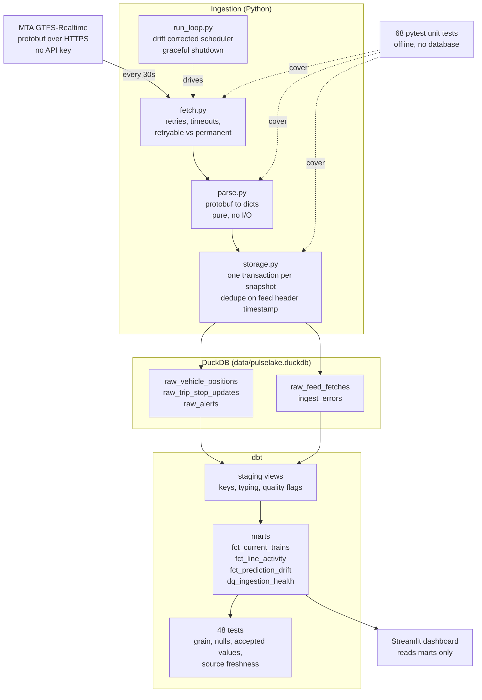

# PulseLake

A working, local, end to end data pipeline over New York City's live subway feed.
Python ingestion, DuckDB storage, dbt modelling with tests, and a Streamlit
dashboard. No cloud account, no API key, no paid services.

---

## The problem

Millions of people plan their day around a subway arrival estimate, and those
estimates are only as trustworthy as the data pipeline behind them. New York
City's MTA publishes live train positions and trip updates as an open
GTFS-Realtime feed, but the raw form is a binary protobuf payload that expires
within seconds, keeps no history, and gives no way to answer questions like
"how late is the 6 line right now compared to twenty minutes ago" or "did we
silently stop receiving data for the L train". PulseLake closes that gap: it
polls the live feed on a schedule, lands every observation in a local
analytical store with the time it was captured, transforms the raw records into
clean modelled tables with data quality tests attached, and serves the result on
a dashboard. The point is not the dashboard. The point is that every layer
between the feed and the chart is inspectable, tested, and can be pointed at
when a number looks wrong.

---

## Quick start

Requires Python 3.11 or newer. Nothing else.

```bash
git clone <your-repo-url> pulselake && cd pulselake
make setup
make start
```

`make start` primes the database, builds the dbt models, then starts three
background processes: the ingestion loop, a dbt refresh loop, and the
dashboard. Open **http://localhost:8501**.

```bash
make status    # what is running, and how fresh the data is
make logs      # tail all three logs
make stop      # stop everything
```

If you would rather run the pieces one at a time, see
[Running each piece separately](#running-each-piece-separately).

---

## Architecture



The layers are separated so each one can be reasoned about and tested alone.
`parse.py` does no I/O, which is what makes the protobuf handling unit testable
without a network connection. The dashboard contains no business logic, so a
wrong number is fixed in dbt and the fix applies to anything else reading the
warehouse.

---

## The data source

```
https://api-endpoint.mta.info/Dataservice/mtagtfsfeeds/nyct%2Fgtfs
```

**No API key and no account are required.** MTA made the subway realtime feeds
fully open in 2023. There is no credential handling anywhere in this project.

That URL is the feed for the numbered lines (1 to 7 plus the 42nd Street
shuttle) and is what PulseLake ingests by default. All eight subway feeds are
configured in `ingest/config.py`; ingest the whole system with:

```bash
PULSELAKE_FEEDS=all make loop
```

### What the feed actually contains

Worth reading before you look at the models, because several design decisions
only make sense in light of it:

| Field | Reality |
|---|---|
| `delay` | **Never populated by NYCT.** Absent from every record. |
| `stop_sequence` | Not populated either. Position in the list is the only ordering. |
| `entity.id` | Unique within a snapshot, **not stable across snapshots**. |
| `trip_id` | **Not unique within a snapshot.** About 1 percent are shared by two trains. |
| Alerts | The one place MTA says outright that a train is delayed. |
| `trip_id` format | Encodes scheduled origin departure and usually direction. |

---

## How delay is measured

Since NYCT publishes no delay figure, PulseLake derives one and is explicit
about how.

For a given train and a given upcoming stop, MTA publishes a predicted arrival
time in every snapshot. If the train is running well that prediction holds
steady. If it is losing time the prediction for that same stop keeps sliding
later. `fct_prediction_drift` measures the difference between the earliest and
latest prediction for the same stop:

```
drift > 0    the train is slipping later, losing time
drift ~ 0    holding to plan
drift < 0    making up time
```

This is the clearest argument in the project for storing history rather than
proxying the live feed. **A single snapshot cannot produce this number.** It
exists only because every fetch was kept.

The second signal is MTA's own service alerts, whose header text reads
"Train delayed". That is observed rather than inferred, so `status_label` in
`fct_current_trains` ranks it above anything derived.

---

## What is in the database

### Raw tables, append only, written by Python

| Table | Grain |
|---|---|
| `raw_vehicle_positions` | one row per train per snapshot |
| `raw_trip_stop_updates` | one row per upcoming stop per trip per snapshot |
| `raw_alerts` | one row per affected trip per alert per snapshot |
| `raw_feed_fetches` | one row per snapshot. The ingestion audit log |
| `ingest_errors` | one row per failed poll |

`ingest_errors` matters more than it looks. Without it, a gap in the raw tables
is indistinguishable from a period when no trains were running.

### Storage growth

Measured on a real run: one feed polled every 30 seconds produced **101
snapshots in 54 minutes, 666,000 stop update rows, and an 18 MB database**.
That is roughly **740,000 rows and 20 MB per hour** for the numbered lines
alone, or about 480 MB per day. Ingesting all eight feeds multiplies it.

The volume comes almost entirely from `raw_trip_stop_updates`: every snapshot
carries every upcoming stop for every train, around 6,800 rows a time. Nothing
is truncated, because prediction drift needs the full history of each stop, and
keeping it is the whole reason the delay model can exist. It is worth knowing
the cost of that decision rather than discovering it when the disk fills. A
retention policy, or partitioning the raw layer by day, is the obvious next
move and is the sort of thing Iceberg would handle properly.

### Models, built by dbt

| Model | What it answers |
|---|---|
| `stg_vehicle_positions` | keys, derived timings, feed quality flags |
| `stg_trip_stop_updates` | predicted arrivals per upcoming stop |
| `stg_alerts` | which trips MTA has flagged as delayed |
| `fct_current_trains` | every train running now, with its next stop and status |
| `fct_line_activity` | one row per line: how many trains, where, how many delayed |
| `fct_prediction_drift` | the delay proxy described above |
| `dq_ingestion_health` | per snapshot pipeline health, including gap detection |

---

## Data quality

48 dbt tests and 68 pytest tests. Both run in about a second.

```bash
make dbt-test    # dbt: grain, nulls, accepted values, referential integrity
make test        # pytest: parsing, retries, storage idempotency
make freshness   # dbt source freshness against the ingestion clock
```

**Test severity is mixed on purpose.**

*Errors*, which should never fire: grain uniqueness on
`snapshot_train_key`, not null on every key, accepted values on decoded enums,
referential integrity between the detail tables and the audit table.

*Warnings*, which document known upstream reality: `unique` on `trip_id` is
expected to warn, because NYCT genuinely reuses trip ids. Making it an error
would mean a red build on every run, which is how teams learn to ignore their
tests. If it ever stops warning, MTA fixed something and the workarounds
downstream can be simplified.

*Source freshness*: warns after 5 minutes without new data, errors after 30.

### Three bugs this project actually had

These are in the repo because they are more instructive than the code that
works, and each one has a test that fails if it comes back.

**1. A retry loop that swallowed its own exception.**
`requests.HTTPError` subclasses `requests.RequestException`. Raising
`HTTPError` for a non retryable status inside the `try` block meant the retry
handler caught it, so a 403 was retried three times with backoff. The test
asserts on the number of calls made, not just that an exception was raised,
because asserting only on the exception would pass against the broken version.

**2. A regex that quietly dropped 6 percent of trains.**
The documented NYCT trip id shape is `{origin}_{route}..{direction}{path}`. In
the live feed, the 42nd Street shuttle uses a single dot (`104150_GS.N04R`) and
some 7 trains carry a terminal name where the direction letter belongs
(`065600_7..MAIN ST34`). The first parser matched neither and returned nulls
for all of them without raising.

**3. A join that matched nothing while every test passed.**
`fct_current_trains` joined train positions to arrival predictions on
`entity_id`. A train appears in the feed as **two separate entities** with
different ids, so the join matched zero rows and every prediction column came
out null. `unique` passed. `not_null` on the keys passed. `accepted_values`
passed. A left join that matches nothing is perfectly well formed.

The lesson from the third one is the reason
`transform/tests/assert_predictions_are_joined.sql` exists: **structural tests
verify that a table is well formed, not that it is correct.** Something has to
assert that the data is actually there.

---

## Concurrency, and why it needed solving

DuckDB takes an **exclusive lock** on the database file. While one process
holds it, no other process can open the file at all, not even read only. A
poller that held its connection open for the whole run therefore blocked both
dbt and the dashboard completely.

The fix is on both sides. The ingestion loop opens and closes its connection
once per cycle, so the file is free for the length of the sleep, which is
better than 95 percent of the time. Readers and writers both wait their turn:
`connect_with_retry` in Python, and the `retries` block in
`transform/profiles.yml` for dbt. That is how all three processes share one
embedded database.

---

## Running each piece separately

```bash
make ingest       # one ingestion cycle, then exit
make loop         # the ingestion loop in the foreground, Ctrl+C to stop
make dbt          # build models and run tests
make dashboard    # Streamlit in the foreground
make test         # unit tests
```

Or drive the modules directly for finer control:

```bash
python -m ingest.preview --rows 5            # fetch and print, store nothing
python -m ingest.preview --feeds all         # all eight subway feeds
python -m ingest.run_once --feeds ACE,L      # ingest specific feeds
python -m ingest.run_loop --interval 20      # custom poll interval
python -m ingest.run_loop --max-cycles 5     # bounded, useful as a smoke test
python -m tests.make_fixture                 # refresh the captured test fixture
```

Configuration is environment driven:

| Variable | Default | Meaning |
|---|---|---|
| `PULSELAKE_DB` | `data/pulselake.duckdb` | database location |
| `PULSELAKE_FEEDS` | `1234567S` | feed keys, or `all` |
| `PULSELAKE_INTERVAL` | `45` | seconds between poll cycles |
| `PULSELAKE_DBT_INTERVAL` | `60` | seconds between dbt rebuilds |
| `PULSELAKE_PORT` | `8501` | dashboard port |

---

## Layout

```
pulselake/
  ingest/          config, fetch, parse, storage, run_once, run_loop
  transform/       dbt project: models, tests, macros, profiles
  dashboard/       Streamlit app and its queries
  tests/           pytest suite plus a captured feed fixture
  scripts/         the process manager behind make start
  data/            the DuckDB file (git ignored)
  logs/            rotating logs (git ignored)
```

---

## This is the local MVP

Everything above runs on one laptop for free, and that is deliberate. The
scaling story below is the honest next step rather than a claim about what is
already built.

### Next steps

**Streaming.** Replace the polling loop with **Kafka**. Ingestion publishes
decoded records to a topic, and consumers land them independently. This buys
replay: today, a bug in the storage layer loses the snapshots taken while it
was broken, because the feed does not keep history.

**Table format.** Move the raw layer to **Apache Iceberg** on object storage.
Schema evolution, time travel, and readers other than DuckDB. The append only
design here was chosen with that migration in mind.

**Orchestration.** Replace `run_loop.py` and the dbt refresh loop with
**Airflow** or **Dagster**. `run_cycle()` is already a single importable
function taking a connection and a feed mapping, so it becomes a task body
without restructuring. The real gain is retries with alerting, backfills, and a
dependency graph between ingestion and transformation instead of two loops
that happen not to collide.

**Infrastructure as code.** **Terraform** for the object store, the warehouse,
and the orchestrator, so the environment is reproducible rather than described
in a README.

**Deployment.** **Kubernetes** for the ingestion service, with the poll
interval and feed list as configuration rather than flags.

**Data quality.** dbt tests cover grain and structure well. **Great
Expectations** or **Soda** add distribution and volume checks: row counts per
snapshot within an expected band, drift in the trip id reuse rate, alerting
when a line stops reporting entirely. `dq_ingestion_health` already computes
several of these; they are just not alerting on anything yet.

**Observability.** **Grafana** over pipeline metrics rather than train data.
Ingest lag, snapshot gaps, feed error rates, dbt run duration. The dashboard's
pipeline health expander is a placeholder for this.

**Enrichment.** Join the static GTFS schedule to get real station names in
place of stop ids like `101N`, and a genuine timetable to compare against,
which would turn the prediction drift proxy into an actual schedule adherence
number.

---

## Licence and attribution

Transit data from the Metropolitan Transportation Authority, used under the
terms of the MTA open data policy. This project is not affiliated with the MTA.
